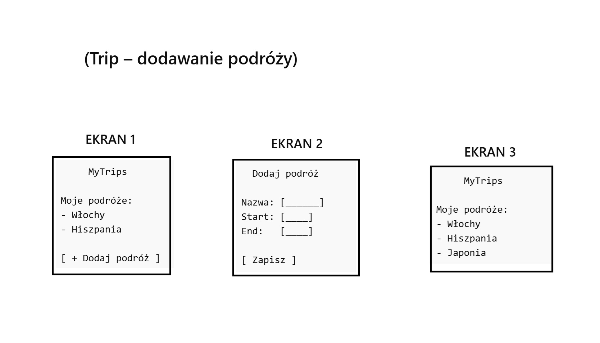
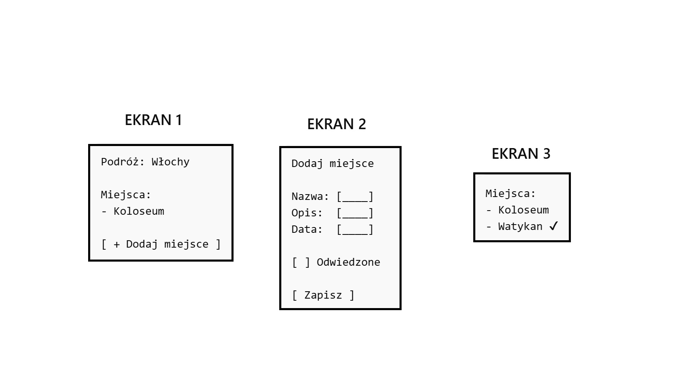
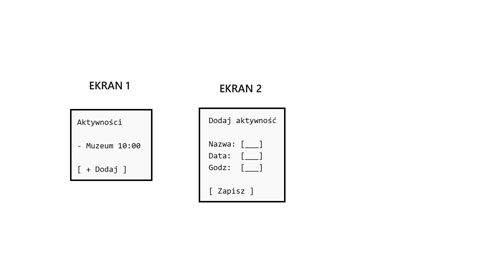
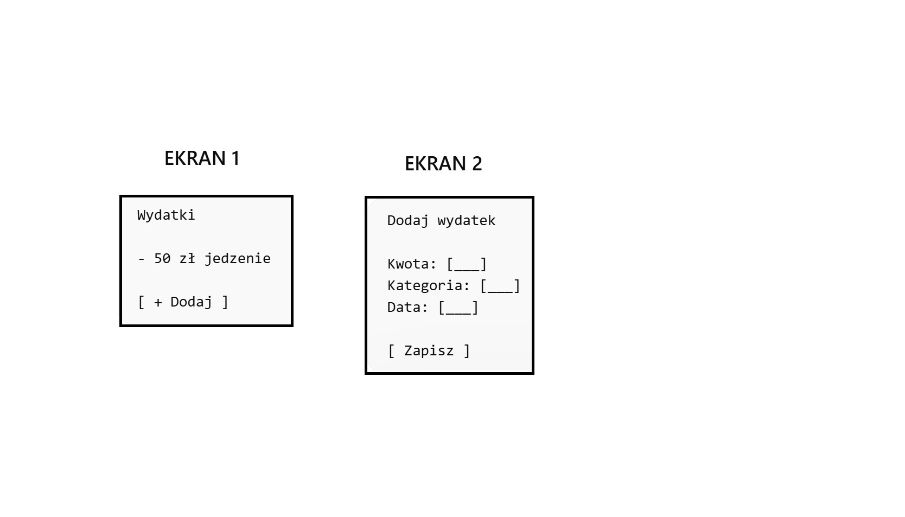
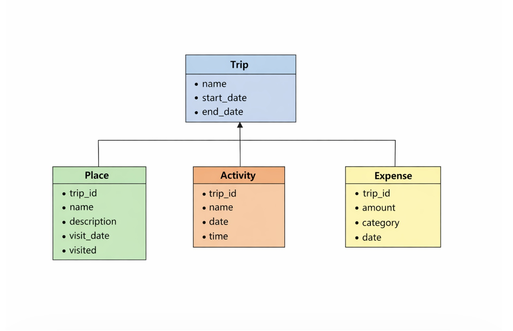

=======
# MyTrips – aplikacja do planowania podróży

## Opis
MyTrips to aplikacja webowa stworzona z myślą o osobach, które lubią podróżować i chcą mieć wszystko związane z wyjazdami w jednym miejscu. 
Celem projektu jest ułatwienie planowania podróży, zarządzania miejscami do odwiedzenia, kontrolowania budżetu oraz śledzenia aktywności w trakcie wyjazdu. 
Dzięki MyTrips użytkownik nie musi tworzyć osobnych notatek ani szukać informacji w różnych miejscach – wszystko, co związane z podróżą, można dodać i sprawdzić w jednym miejscu.

Każda podróż w aplikacji ma nazwę, datę rozpoczęcia i zakończenia. 
Dodanie podróży jest bardzo proste – użytkownik wprowadza nazwę wyjazdu, daty i zapisuje podróż. 
Następnie można dodawać do niej miejsca, które chce się odwiedzić, z dokładnym opisem i planowaną datą wizyty. 
Dodatkowo można zaznaczyć, które miejsca już zostały odwiedzone, co pozwala na łatwe śledzenie postępu podróży. 
To szczególnie przydatne w przypadku dłuższych wyjazdów lub wyjazdów wieloetapowych, kiedy trudno zapamiętać wszystkie miejsca do odwiedzenia.

Oprócz miejsc użytkownik może planować aktywności – na przykład wizyty w muzeach, wydarzenia kulturalne, wycieczki czy spotkania. 
Każda aktywność ma przypisaną datę i godzinę, co pozwala tworzyć harmonogram podróży. 
Dzięki temu użytkownik może zobaczyć, co ma zaplanowane danego dnia i w jakiej kolejności realizować aktywności. 
To sprawia, że planowanie staje się bardziej przejrzyste i łatwiej unikać konfliktów czasowych podczas wyjazdu.

Aplikacja MyTrips umożliwia również kontrolowanie wydatków związanych z podróżą. 
Użytkownik może dodawać wydatki, określając kwotę, kategorię (na przykład jedzenie, transport, noclegi) i datę wydatku. 
Dzięki temu łatwo śledzić, ile pieniędzy zostało wydane, a ile pozostało w budżecie. 
Funkcja ta jest przydatna nie tylko dla osób podróżujących indywidualnie, ale także dla grup, które chcą wspólnie monitorować koszty.

Całość aplikacji działa w panelu administracyjnym Django, co umożliwia pełną kontrolę nad wszystkimi obiektami. 
Administrator może dodawać, edytować i usuwać podróże, miejsca, aktywności i wydatki. 
Na razie wszystkie testy i wprowadzanie danych odbywa się właśnie w panelu admina, co jest szybkie i wygodne, zwłaszcza podczas tworzenia projektu. 
W przyszłości możliwe jest dodanie widoku dla zwykłego użytkownika, który pozwoli wprowadzać dane bez logowania do panelu administracyjnego, co sprawi, że korzystanie z aplikacji będzie jeszcze prostsze i bardziej intuicyjne.

Podsumowując, MyTrips to praktyczne narzędzie dla każdego, kto chce mieć porządek w swoich podróżach. 
Ułatwia planowanie, śledzenie miejsc i aktywności oraz kontrolowanie wydatków. 
Dzięki prostemu interfejsowi i funkcjonalnościom aplikacja pozwala oszczędzić czas i uniknąć chaosu, który często pojawia się podczas przygotowywania wyjazdu. 
To także świetny projekt do nauki obiektowego podejścia w programowaniu, ponieważ wszystkie dane – podróże, miejsca, aktywności i wydatki – są reprezentowane przez obiekty w Django, które mają swoje właściwości i relacje między sobą.
## Wymagania funkcjonalne
1. Użytkownik może dodać nową podróż z nazwą oraz datami rozpoczęcia i zakończenia.  
2. Użytkownik może dodać miejsca do konkretnej podróży z opisem i datą wizyty.  
3. Użytkownik może planować aktywności przypisane do podróży z datą i godziną.  
4. Użytkownik może dodawać wydatki związane z podróżą wraz z kwotą i kategorią.  
5. Administrator może edytować i usuwać wszystkie wpisy w panelu admina Django.  
6. Użytkownik może oznaczać miejsca jako odwiedzone.

## User Stories / UX
### Trip

**User Story:**  
Jako użytkownik chcę dodać podróż, aby zaplanować wyjazd.

- Ekran „Lista podróży” – użytkownik widzi swoje podróże oraz przycisk „Dodaj podróż”  
- [Przycisk „Dodaj podróż”] → przejście do formularza  
- Formularz: Nazwa | Start | End → [Save]  
- Po zapisaniu → powrót do listy i nowa podróż widoczna na ekranie  

---

### Place

**User Story:**  
Jako użytkownik chcę dodawać miejsca, aby zaplanować zwiedzanie.

- Ekran „Miejsca w podróży” – lista miejsc + przycisk „Dodaj miejsce”  
- [Przycisk „Dodaj miejsce”] → formularz  
- Formularz: Trip | Nazwa | Opis | Data | Odwiedzone → [Save]  
- Po zapisaniu → powrót do listy miejsc  

---

### Activity

**User Story:**  
Jako użytkownik chcę planować aktywności, aby uporządkować harmonogram.

- Ekran „Aktywności” – lista + przycisk „Dodaj aktywność”  
- [Przycisk „Dodaj aktywność”] → formularz  
- Formularz: Trip | Nazwa | Data/Time → [Save]  
- Po zapisaniu → aktywność pojawia się na liście  

---

### Expense

**User Story:**  
Jako użytkownik chcę dodawać wydatki, aby kontrolować budżet.

- Ekran „Wydatki” – lista + przycisk „Dodaj wydatek”  
- [Przycisk „Dodaj wydatek”] → formularz  
- Formularz: Trip | Kwota | Kategoria | Data → [Save]  
- Po zapisaniu → wydatek pojawia się na liście  

## Model danych (ERD)
Diagram przedstawia encje aplikacji, ich atrybuty oraz relacje między podróżami, miejscami, aktywnościami i wydatkami.

[Trip]
- name
- start_date
- end_date

[Place]
- trip_id → Trip
- name
- description
- visit_date
- visited

[Activity]
- trip_id → Trip
- name
- date
- time

[Expense]
- trip_id → Trip
- amount
- category
- date

