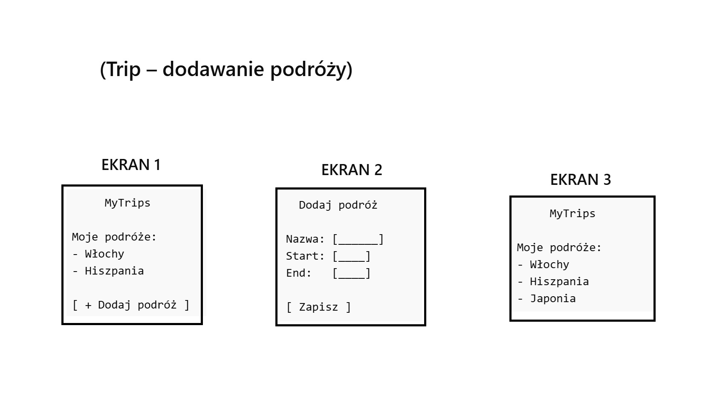
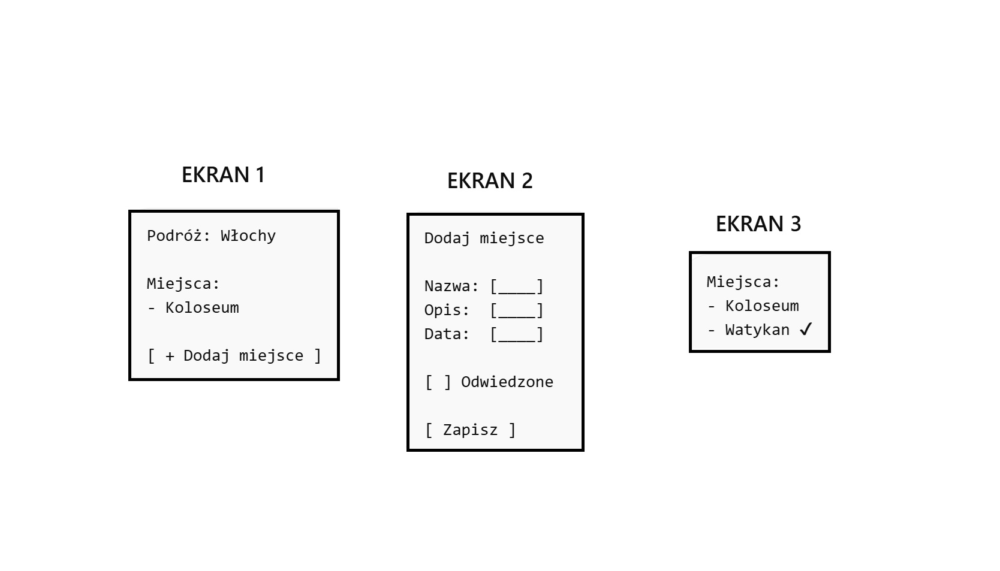
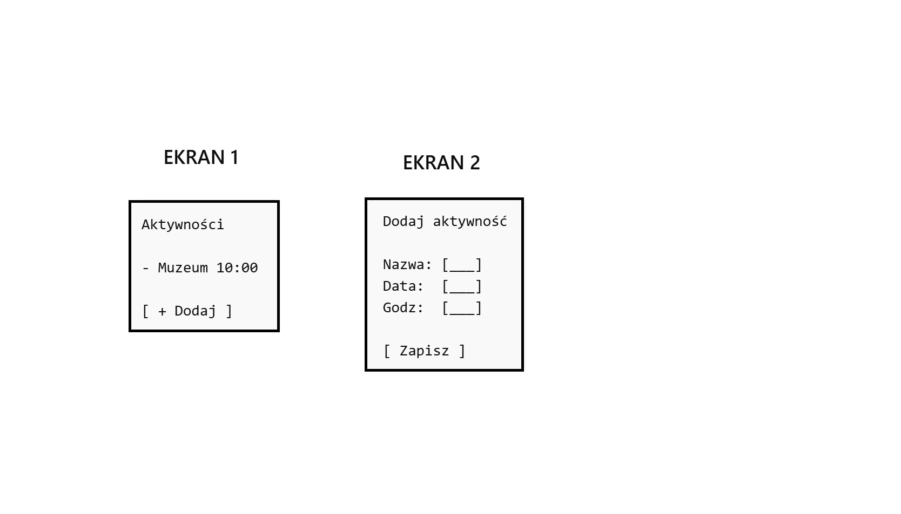
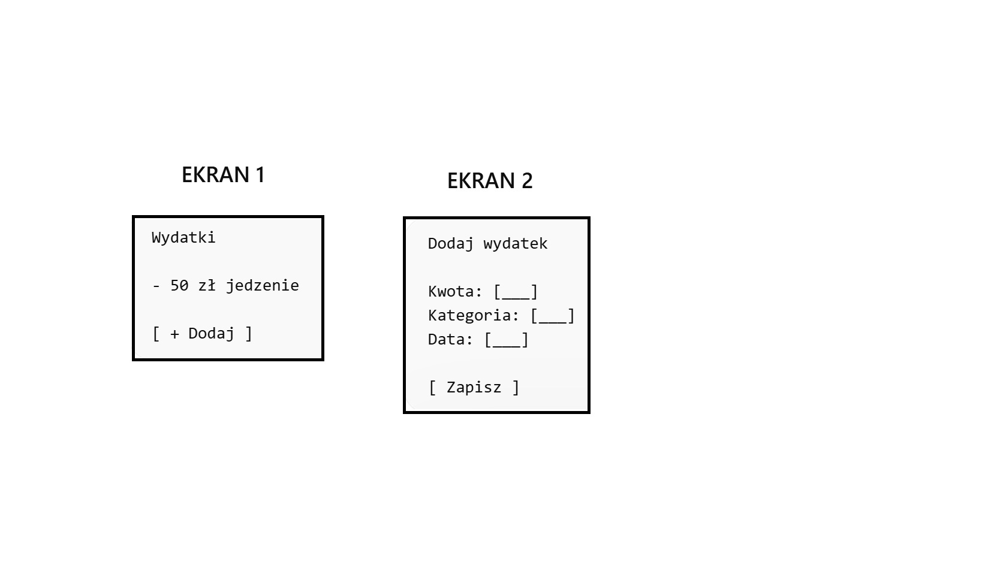
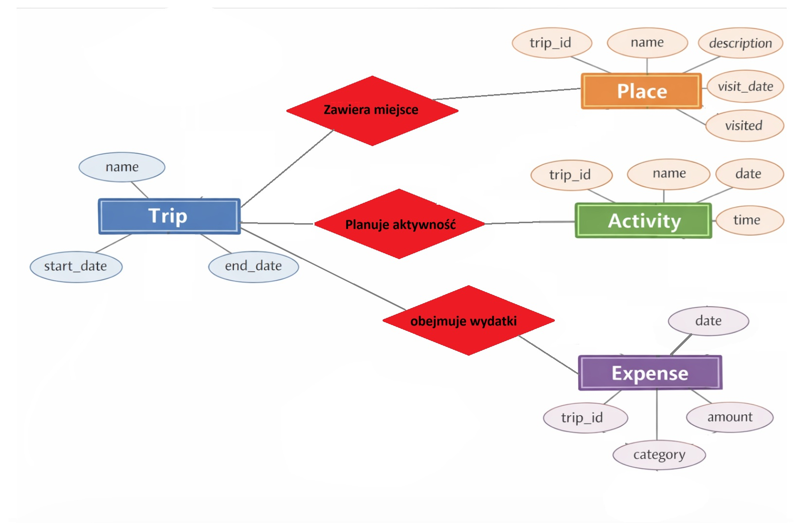

# MyTrips – aplikacja do planowania podróży

## Opis
MyTrips to aplikacja webowa stworzona dla osób, które lubią podróżować i chcą mieć wszystko związane z wyjazdami w jednym miejscu.
Celem projektu jest ułatwienie planowania podróży, zarządzania miejscami do odwiedzenia, kontrolowania budżetu oraz śledzenia aktywności w trakcie wyjazdu.
Zamiast tworzyć osobne notatki i szukać informacji w różnych miejscach, wszystko można dodać i sprawdzić w jednym miejscu.

Każda podróż ma nazwę, datę rozpoczęcia i zakończenia. Można do niej dodawać miejsca, które chce się odwiedzić – wystarczy wpisać adres, a aplikacja automatycznie znajdzie współrzędne i pokaże miejsce na mapie Google Maps. Pinezki na mapie pozwalają szybko zobaczyć, gdzie zaplanowane są wszystkie miejsca w danej podróży. Można też zaznaczyć, które miejsca już zostały odwiedzone.

Oprócz miejsc można planować aktywności – wizyty w muzeach, wycieczki, wydarzenia kulturalne. Każda aktywność ma przypisaną datę i godzinę, dzięki czemu łatwo tworzyć harmonogram wyjazdu i unikać konfliktów czasowych.

Aplikacja pozwala też kontrolować wydatki – można dodawać kwoty z kategorią i datą, żeby śledzić ile zostało wydane i ile zostało w budżecie. Przydatne zarówno przy podróżach solo, jak i grupowych.

Całość działa w panelu administracyjnym Django, który umożliwia dodawanie, edytowanie i usuwanie wszystkich danych. W przyszłości planowane jest dodanie widoku dla zwykłego użytkownika, bez konieczności logowania do panelu admina.

## Wymagania funkcjonalne
1. Użytkownik może dodać nową podróż z nazwą oraz datami rozpoczęcia i zakończenia.  
2. Użytkownik może dodać miejsca do konkretnej podróży z opisem i datą wizyty.  
3. Użytkownik może zobaczyć wszystkie miejsca podróży na mapie Google Maps.  
4. Użytkownik może dodać adres miejsca i automatycznie uzyskać jego współrzędne.  
5. Użytkownik może planować aktywności przypisane do podróży z datą i godziną.  
6. Użytkownik może dodawać wydatki związane z podróżą wraz z kwotą i kategorią.  
7. Administrator może edytować i usuwać wszystkie wpisy w panelu admina Django.  
8. Użytkownik może oznaczać miejsca jako odwiedzone.

## User Stories / UX
### Trip

**User Story:**  
Jako użytkownik chcę dodać podróż, aby zaplanować wyjazd.

- Ekran „Lista podróży" – użytkownik widzi swoje podróże oraz przycisk „Dodaj podróż"  
- [Przycisk „Dodaj podróż"] → przejście do formularza  
- Formularz: Nazwa | Start | End → [Save]  
- Po zapisaniu → powrót do listy i nowa podróż widoczna na ekranie  

---

### Place

**User Story:**  
Jako użytkownik chcę dodawać miejsca, aby zaplanować zwiedzanie.

- Ekran „Miejsca w podróży" – lista miejsc + przycisk „Dodaj miejsce"  
- [Przycisk „Dodaj miejsce"] → formularz  
- Formularz: Trip | Nazwa | Opis | Data | Odwiedzone → [Save]  
- Po zapisaniu → powrót do listy miejsc  

---

### Activity

**User Story:**  
Jako użytkownik chcę planować aktywności, aby uporządkować harmonogram.

- Ekran „Aktywności" – lista + przycisk „Dodaj aktywność"  
- [Przycisk „Dodaj aktywność"] → formularz  
- Formularz: Trip | Nazwa | Data/Time → [Save]  
- Po zapisaniu → aktywność pojawia się na liście  

---

### Expense

**User Story:**  
Jako użytkownik chcę dodawać wydatki, aby kontrolować budżet.

- Ekran „Wydatki" – lista + przycisk „Dodaj wydatek"  
- [Przycisk „Dodaj wydatek"] → formularz  
- Formularz: Trip | Kwota | Kategoria | Data → [Save]  
- Po zapisaniu → wydatek pojawia się na liście  

## Model danych (ERD)
Diagram przedstawia encje aplikacji, ich atrybuty oraz relacje między podróżami, miejscami, aktywnościami i wydatkami.

 

[Trip]
- name
- start_date
- end_date

[Place]
- trip_id → Trip
- name
- address
- notes
- latitude
- longitude

[Activity]
- trip_id → Trip
- name
- date
- time

[Expense]
- trip_id → Trip
- amount
- category
- date

